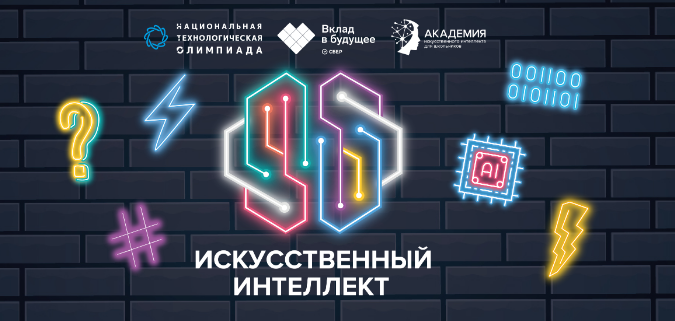
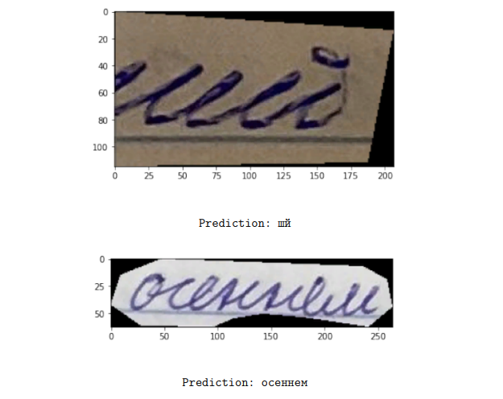

# Модель ИИ распознавания русского рукописного текста

  
   
  

## Описание

Этот проект на PyTorch реализует модель искусственного интеллекта для распознавания рукописного текста. Модель состоит из двух частей:

1.  **Модель сегментации изображения:** Определяет отдельные символы или слова на изображении рукописного текста. Разработана на основе Detectron2.
2.  **OCR Модель распознавания текста:** Преобразует сегментированные изображения в текстовые строки.

**Проект был разработан на Python с использованием библиотеки Detectron2 (Facebook AI Research) и предобученной модели COCO-InstanceSegmentation/mask_rcnn_X_101_32x8d_FPN_3x в рамках участия в олимпиаде НТО по ИИ 2022. Проект был высоко оценен жюри и получил допуск к заключительному этапу олимпиады.**

## Возможности

*   Распознавание рукописного текста на изображениях.
*   Использование библиотеки Detectron2 для сегментации изображений.
*   Примеры использования и демонстрация работы.
*   Возможность обучения модели на новых данных.
